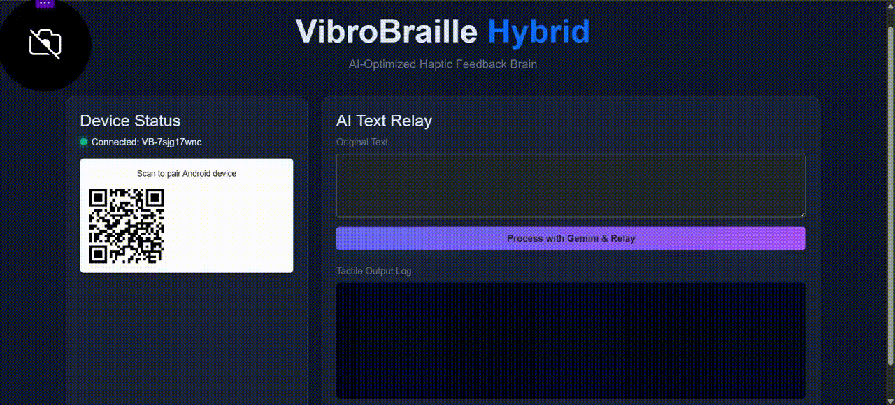

# VibroBraille Hybrid: AI-Powered Tactile Literacy

VibroBraille Hybrid is an assistive technology system designed to bridge the gap between digital text and tactile sensation. Leveraging Google Gemini AI, the system simplifies complex information into concise, braille-ready segments and transmits them to a mobile device for real-time haptic feedback.

---

## Demonstration

| AI Dashboard (Web) | Mobile Haptic Interface |
| :---: | :---: |
|  |  |
| *Processing and Simplifying Text* | *Real-time Tactile Delivery* |

---

## Key Features

- **Gemini AI Integration**: Automatically simplifies complex sentences into core meanings optimized for braille reading.
- **Real-time Data Relay**: Low-latency WebSocket connection between the backend (Web) and the mobile application (Body).
- **Haptic Waveform Encoding**: Converts braille dot patterns into precise vibration timings and amplitudes.
- **Hybrid Architecture**: Integrates a Node.js/Express backend with a responsive Flutter mobile application.
- **Session Management**: Secure pairing between devices using unique Session IDs.

---

## System Architecture

1.  **Backend (Brain)**: Developed using Node.js, Express, and Socket.io. It manages the Gemini AI pipeline and the device pairing dashboard.
2.  **Processing Pipeline**: Standardizes input text, generates simplified versions via Gemini 1.5 Flash, and relays data via WebSockets.
3.  **Mobile Client (Body)**: A Flutter application that translates received text into Braille patterns and executes custom haptic pulses via Native Method Channels.

---

## Getting Started

### 1. Backend Configuration
```bash
cd web
npm install
```
- Create a `.env` file in the `web` directory:
  ```env
  GEMINI_API_KEY=your_key_here
  PORT=3000
  ```
- Start the server:
  ```bash
  npm start
  ```

### 2. Mobile Application Setup
- Ensure the Flutter SDK is installed and configured.
- Update the WebSocket URL in `mobile/lib/main.dart` with your computer's local IP address:
  ```dart
  url: 'ws://YOUR_COMPUTER_IP:3000'
  ```
- Initialize the application:
  ```bash
  cd mobile
  flutter pub get
  flutter run
  ```

---

## Technology Stack

- **Backend**: Node.js, Express.js, WebSocket (ws)
- **Artificial Intelligence**: Google Generative AI (Gemini SDK)
- **Frontend**: HTML5, Bootstrap 5 (Glassmorphism Design)
- **Mobile**: Flutter, Provider
- **Communication Protocol**: Custom JSON-based WebSocket Protocol

---

## Contributing

Contributions are welcome. Please feel free to submit a Pull Request or report issues related to haptic encoding patterns or AI simplification logic.

---

## License

Distributed under the MIT License. Refer to the `LICENSE` file for further details.
