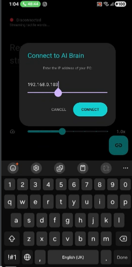

# VibroBraille Hybrid (V3) — AI-Powered Tactile Literacy

**Winner / Entry for [Hackathon Name]**

> The PC understands. The phone feels. The user reads through touch.

VibroBraille is a distributed assistive system that converts **AI-simplified meaning** into **temporal Braille vibration** on commodity Android phones. A PC (the *Conductor*) performs heavy AI work (Google Gemini 1.5 Pro), and one or more phones (the *Actuators*) act as dumb haptic terminals that render deterministic Braille as vibration waveforms.

---

## Demo (visuals)

> Place demo files in `assets/` (see **Assets** below).  

| Conductor (Web Dashboard) | Mobile Haptic App |
|:---:|:---:|
|  |  |
|  |  |
|  |  |

---

## Quick TL;DR (For judges / demo)
1. `cd web && npm install && node server.js` → Open `http://localhost:3000` (QR will show).  
2. `cd mobile && flutter pub get && flutter run --release -d <device>` on Android phone (same Wi-Fi).  
3. Scan the QR or enter PC IP in the app → press **Link**.  
4. Copy text on PC (Ctrl+C) or paste text into the dashboard → phone vibrates word-by-word.

---

## Table of Contents

1. [Features](#features)  
2. [Architecture](#architecture)  
3. [Assets to add](#assets-to-add)  
4. [Prerequisites](#prerequisites)  
5. [Line-by-line Installation & Setup](#line-by-line-installation--setup)  
6. [How to Connect (exact steps)](#how-to-connect-exact-steps)  
7. [Demo script (for presentation)](#demo-script-for-presentation)  
8. [WebSocket Events / TactileScript Schema](#websocket-events--tactilescript-schema)  
9. [Troubleshooting — exact checks & fixes](#troubleshooting---exact-checks--fixes)  
10. [What NOT to do (critical)](#what-not-to-do-critical)  
11. [Contributing, License, Credits](#contributing-license-credits)

---

## Features

- **Gemini 1.5 Pro Brain**: AI simplifies content to tactile-friendly chunks.  
- **Temporal Braille Encoding**: converts 2×3 Braille cells into time-domain waveforms.  
- **TactileScript**: JSON intermediate representation for replay, speed control, logging.  
- **Broadcast Architecture**: Single PC can control multiple phones simultaneously.  
- **Active Motor Safety**: `vibrator.cancel()` + server pacing to avoid buffer/thermal issues.  
- **Multimodal**: Ingest text, PDFs, images; image → description → tactile narrative.  
- **QR pairing + Manual IP fallback**.

---

## Architecture

User Input (text/pdf/image)
→ Conductor (Node.js + Gemini)
→ TactileScript JSON (SET_SENTENCE, WORD events)
→ WebSocket (ws)
→ Actuator (Flutter + Kotlin)
→ Temporal Encoder → VibrationEffect (Android)
→ Human Tactile Perception


---

## Assets to add (place in `assets/`)

Put these files in `assets/` exactly (filenames are case-sensitive):

- `linkage.png` — IP entry / QR dialog screenshot
- `post_linkage.png` — Mobile app screenshot (connected)
- `pre_state.png` — Idle / Ready to receive tactile stream
- `copied_clipboard_relay.gif` — Demo: copy text → phone vibrates
- `PDF intake to braile.gif` — Demo: upload PDF → tactile output

> After adding assets run `git add assets/* && git commit -m "Add demo assets"`.

---

## Prerequisites

- PC (Windows / Linux / macOS) on same Wi-Fi as phone  
- Node.js 16+ (LTS recommended)  
- Flutter SDK 3.0+ and Android SDK (for building the app)  
- Android phone (8.0+) with vibration hardware  
- Google Gemini API key (set as `GEMINI_API_KEY` in `.env`)  
- Optional: `ngrok` for remote demos (see Troubleshooting)

---

## Line-by-line Installation & Setup (exact commands)

### 1) Clone repo
```bash
git clone https://github.com/<your-org>/vibrobraille-hybrid.git
cd vibrobraille-hybrid
````

### 2) Backend (Conductor)

```bash
cd web
npm install
```

Create `.env` in `web/` with:

```env
GEMINI_API_KEY=your_gemini_key_here
PORT=3000
ALLOW_LOCALHOST=1
```

Start server:

```bash
# Development
node server.js

# OR (if using nodemon)
npx nodemon server.js
```

Open dashboard: `http://localhost:3000`
You should see a QR code and **Tactile Stream Log**.

### 3) Mobile (Actuator)

```bash
cd mobile
flutter pub get
```

Connect phone via USB or use wireless ADB and run:

```bash
# For best haptic timing, use release build:
flutter run --release -d <device-id>
```

If you do not use `--release`, haptic timing may be imprecise in debug mode.

---

## How to Connect — EXACT steps (do this in demo)

Follow these EXACT steps — no skipping:

1. **Same Wi-Fi**: Ensure PC and phone are on the same network (same SSID). If multi-band router, prefer same band.
2. **Start Conductor**: `node server.js` (web dashboard shows QR).
3. **Open Mobile App**: Launch the app on your Android phone.
4. **Link Method A — QR**: Tap **Link to Brain** → scan the QR code on the web dashboard.

   * App will auto-fill pairing token and connect.
5. **Link Method B — Manual IP (fallback)**: If QR fails:

   * On PC, run `ipconfig` (Windows) or `ip a` / `ifconfig` (Linux/macOS) to find local IP (e.g., `192.168.0.103`).
   * In the app, choose **Manual IP** and enter `http://192.168.0.103:3000` or only the IP if the app asks for IP alone.
6. **Connection Confirmation**:

   * Dashboard shows “Device paired” and Tactile Stream Log shows `Session opened`.
   * Mobile status dot becomes green: “Connected to AI Brain — streaming tactile words...”
7. **Demo**: Try clipboard mode — copy text on PC and verify phone vibrates.

---

## Demo Script (line-by-line for presentation)

1. Start server: `node server.js` (show QR).
2. Launch phone app, scan QR. Show green connection.
3. Copy a paragraph into a text editor → copy (Ctrl+C).
4. Web dashboard log shows `Streaming word: ...`. Phone vibrates for each word.
5. Upload a PDF → show `Extract & Relay`. Dashboard displays simplified sentences. Phone renders the sequence.
6. Show mobile controls: speed slider, next/previous gestures. Use them to adjust reading speed live.
7. End demo, show logs, explain TactileScript JSON snippet.

---

## WebSocket Events & TactileScript (exact examples)

**Important events** the server emits:

```json
// SET_SENTENCE
{
  "event": "SET_SENTENCE",
  "payload": {
    "sentence_id": 42,
    "text": "Hello world",
    "timing_profile": "default_1200ms"
  }
}

// WORD
{
  "event": "WORD",
  "payload": {
    "word": "Hello",
    "position": 1,
    "braille": [[1,2,5],[...]],
    "timings": [100,50,100,300],
    "amplitudes": [255,0,255,0]
  }
}
```

**TactileScript (sample)**:

```json
{
  "sentence_id": 12,
  "words": [
    {"text": "Hello", "braille": [[1,2,5],[1,5]], "timings":"default"},
    {"text": "World", "braille": [[1,3,5]], "timings":"default"}
  ],
  "timing_profile": "1200ms"
}
```

Mobile client must:

1. Call `vibrator.cancel()` before every waveform.
2. Create `VibrationEffect.createWaveform(timings, amplitudes)` and play.
3. Send gesture messages (`NEXT`, `PREVIOUS`, `SPEED`) back to server as JSON events.

---

## Troubleshooting — exact checks & fixes

**No connection**

* Check PC IP: `ipconfig` / `ip a`.
* Windows Firewall: Allow `node.exe` through firewall for private networks.
* Ensure server running on port `3000`.
* Make sure phone and PC are on same SSID and subnet.

**App shows disconnected**

* Re-scan QR or enter IP manually.
* Restart app if persists.

**Phone doesn’t vibrate**

* Confirm phone not in Do Not Disturb or Silent mode (some OEMs block haptics).
* Check app permissions (VIBRATE permission granted).
* Test a simple vibration via ADB:

  ```bash
  adb shell cmd vibrator vibrate 100
  ```
* Use Release build for deterministic haptics.

**Haptics stutter or overlap**

* Ensure client calls `vibrator.cancel()` before starting new waveform.
* Confirm server `T_server_gap` is >= waveform duration; default is `1200ms`.

**Gemini API errors**

* Ensure `GEMINI_API_KEY` valid and not rate-limited.
* Check logs for `429` or `401` errors; rotate key or throttle requests.

**Remote demo (Internet-only)**

* Use `ngrok http 3000` on PC and share the `https://...ngrok.io` URL to the mobile app (only for remote demo; be mindful of latency).

---

## What NOT to do (critical)

* **Do not** demo on phone with battery saver / extreme power saving enabled. It kills haptics.
* **Do not** use debug Flutter build for timing-critical demo; use `--release`.
* **Do not** run server behind a restrictive corporate VPN that blocks local traffic between devices.
* **Do not** attempt to run multiple Node servers on same port `3000` (bind error).
* **Do not** use public cellular networks unless you use secure tunneling and expect latency.

---

## Performance Tips & Settings (for best demo)

* Use a modern Android device with good vibrator hardware (Samsung S10+ / Pixel recommended).
* Disable battery optimization for the app: Settings → Battery → Battery optimization → Exempt app.
* Keep the phone screen on during demo or allow app to run in foreground.
* Use `--release` Flutter build for best latency and motor stability.

---

## Contribution & Development

* `server/` — Node.js Conductor (AI integration, WebSocket dispatcher)
* `mobile/` — Flutter Actuator (UI, WebSocket client, native haptics bridge)
* `android/` — Kotlin haptic bridge (VibratorManager usage)
* `web-console/` — Dashboard UI and pairing interface
* `docs/` — Research dossier, flowchart, tests

If you want starter code for `server/index.js` and `mobile` skeleton, open an issue and I’ll provide ready-to-run templates.

---

## License

MIT — see `LICENSE`.

---

## Credits

* Authors: **Gurarpit Singh**, **Mehardeep Singh**
* AI: Google Gemini 1.5 Pro
* Built for: [Hackathon Name]

---

## Appendix: Quick checklist before demo

1. PC and phone on same Wi-Fi.
2. `cd web && node server.js` and dashboard reachable.
3. Phone has the app installed & running.
4. QR shows on dashboard; scan it.
5. Confirm green “Connected to AI Brain” on phone.
6. Copy-paste a paragraph → phone vibrates.
7. If any failures, consult Troubleshooting section above.

---

```
